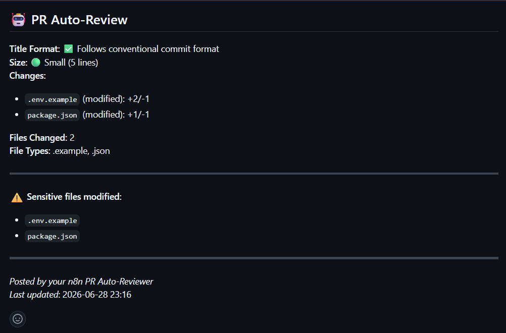
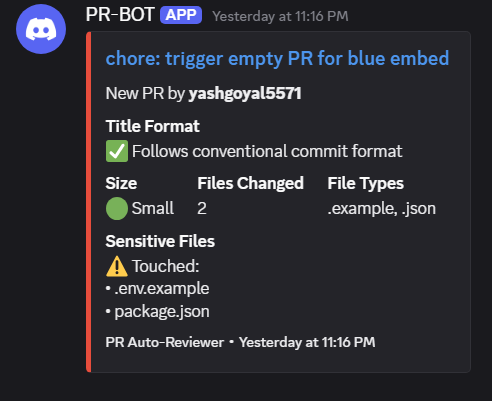
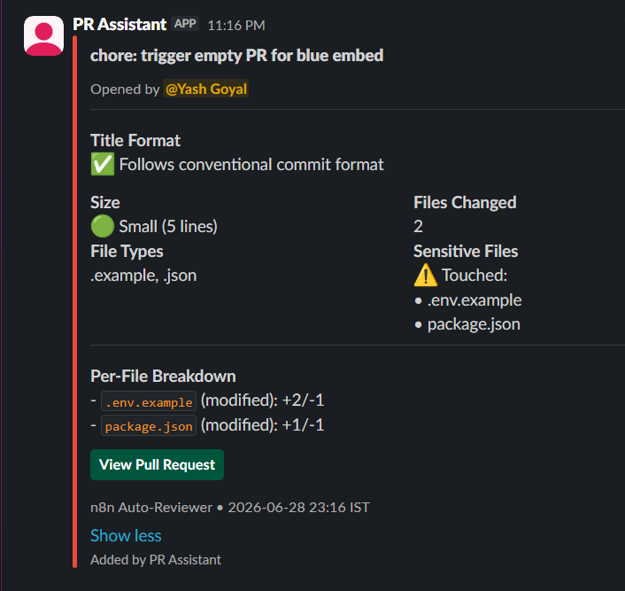
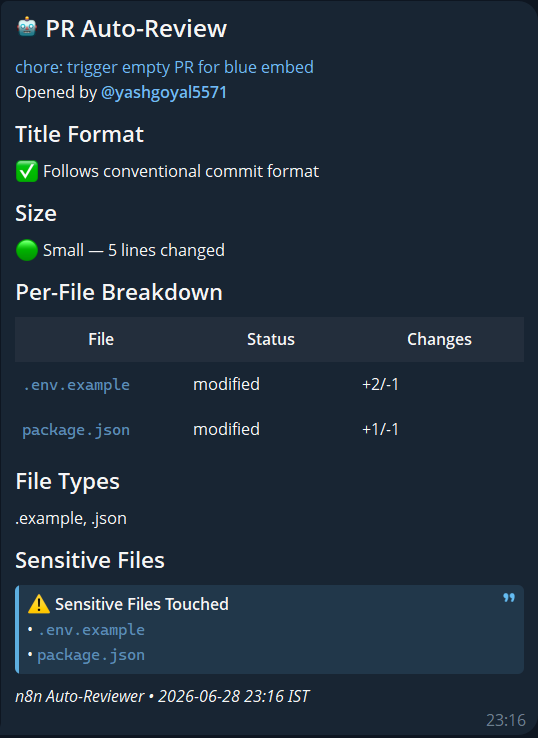
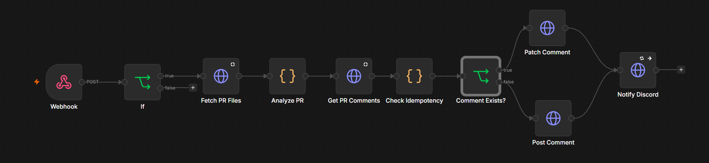

# PR Auto-Reviewer

An n8n workflow that automatically reviews GitHub pull requests and posts structured feedback as a comment. Triggers on every PR open and every subsequent commit push. Maintains a single idempotent comment per PR across all commits.

Sends notifications to Slack, Discord, and Telegram — any one, any two, or all three simultaneously — controlled by boolean flags in a single Edit Fields node.

All webhook payloads are verified using HMAC-SHA256 signature validation before any workflow logic executes.

Live demo sandbox: [pr-reviewer-test](https://github.com/yashgoyal5571/pr-reviewer-test)

---

## 🚀 Visual Highlights

Get immediate, structured insights wherever your team works.

| PR Overview (GitHub) | Discord Notification | Slack Alert | Telegram Alert |
| :---: | :---: | :---: | :---: |
|  |  |  |  |

---

## What it does

When a pull request is opened or updated:

1. Verifies the GitHub webhook signature using HMAC-SHA256
2. Fetches all changed files via GitHub REST API with full pagination
3. Runs 6 checks against the PR data
4. Scans existing PR comments for its own hidden marker
5. Posts a new comment or patches the existing one in place
6. Sends a structured notification to whichever platforms are enabled

No duplicate comments accumulate across multiple commits to the same PR.

---

## Checks

| Check | Logic |
|---|---|
| Title format | Validates against Conventional Commits prefixes: feat, fix, docs, style, refactor, test, chore, perf, ci, build |
| PR size | Small under 50 lines, Medium 50–199, Large 200–499, Very Large 500+ |
| Files changed | Per-file breakdown with filename, status, additions, and deletions |
| File types | All unique extensions present in the PR |
| Sensitive files | Flags package.json, package-lock.json, yarn.lock, .env, .env.local, .env.production, requirements.txt, Dockerfile, docker-compose.yml, .github/workflows |
| Idempotency | Scans for hidden HTML marker `<!-- pr-auto-reviewer-v1 -->`, patches if found, posts if not |

Sensitive file detection overrides the size-based color on all platforms.

---

## Notification platforms

The Switch node runs in All Matching mode — every branch whose flag is true fires simultaneously.

| Platform | Format | Color-coded |
|---|---|---|
| Discord | Embed with fields, footer, and timestamp | Yes |
| Slack | Block Kit attachment with sections, fields, and View PR button | Yes |
| Telegram | Rich Message (Bot API 10.1) with headings, table, and blockquote | No |

To change which platforms fire, open the Edit Fields node and set `discord`, `slack`, `telegram` to `true` or `false`. Examples:

| Desired behavior | discord | slack | telegram |
|---|---|---|---|
| All three | true | true | true |
| Slack only | false | true | false |
| Discord + Telegram | true | false | true |
| GitHub comment only | false | false | false |

---

## Color logic (Discord and Slack)

| Color | Condition |
|---|---|
| Red | One or more sensitive files modified |
| Green | Small PR, no sensitive files |
| Yellow | Medium PR, no sensitive files |
| Orange | Large or Very Large PR, no sensitive files |
| Blue | No files detected (fallback) |

---

## Workflow diagram



```
GitHub PR event (opened or synchronize)
              |
   Github Webhook (PR Events) (n8n)
         Raw Body enabled
              |
      Verify Signature
   HMAC-SHA256 check against
   GITHUB_WEBHOOK_SECRET env var
   Rejects spoofed payloads instantly
              |
     Set Notification Flags
   Sets discord / slack / telegram flags
              |
     Is PR Opened or Sync?
   Passes opened and synchronize only
              |
    Fetch PR Files — GitHub REST API
    Paginated — all files regardless of count
              |
         Analyze PR
   Runs all 6 checks
   Builds GitHub comment, Discord embed,
   Slack Block Kit, Telegram Rich HTML
              |
    Get PR Comments — GitHub REST API
    Paginated — all comments
              |
       Check Idempotency
   Scans for <!-- pr-auto-reviewer-v1 -->
   Passes all payloads downstream
              |
     Comment Exists? (IF node)
      |               |
   true             false
      |               |
 Patch Comment    Post Comment
      |               |
      +-------+-------+
              |
   Route Enabled Platforms — All Matching mode
   Fires every enabled platform in parallel
      |            |            |
  Notify       Notify       Notify
  Discord      Slack        Telegram
```

---

## Example GitHub comment

```
🤖 PR Auto-Review

Title Format: ✅ Follows conventional commit format

Size: 🟢 Small (34 lines)
Changes:
- `dockerfile` (modified): +15/-0
- `package.json` (modified): +4/-9
- `test.md` (modified): +6/-0
Files Changed: 3
File Types: (no ext), .json, .md

⚠️ Sensitive files modified:
- package.json

---
Posted by your n8n PR Auto-Reviewer
Last updated: 2026-06-28 16:51
```

---

## Tech stack

| Tool | Role |
|---|---|
| n8n | Workflow orchestration, self-hosted via Docker |
| GitHub Webhooks | Triggers the workflow on PR events |
| GitHub REST API | Fetches changed files (paginated), posts and patches comments |
| Discord Webhooks | Color-coded embed notifications |
| Slack API | Block Kit attachment via chat.postMessage |
| Telegram Bot API 10.1 | Rich Message via sendRichMessage |

---

## Setup

### Prerequisites

- A running n8n instance with a public HTTPS URL
- A GitHub account and a target repository
- Credentials for whichever platforms you want to enable

### Step 1 — Import the workflow

Download `PR-Reviewer.json` from this repo and import it into your n8n instance via the top-right workflow menu.

### Step 2 — Create the GitHub credential

In n8n Credentials, create an **HTTP Header Auth** named exactly `Github PAT v2`:
- Header Name: `Authorization`
- Header Value: `Bearer YOUR_GITHUB_PAT`

Your GitHub PAT needs `repo` scope. Attach this credential to: Fetch PR Files, Get PR Comments, Post Comment, Patch Comment.

### Step 3 — Set environment variables

Add these to your Docker environment or n8n Cloud Variables:

```
GITHUB_WEBHOOK_SECRET=your_generated_secret
NODE_FUNCTION_ALLOW_BUILTIN=crypto
DISCORD_PR_WEBHOOK_URL=https://discord.com/api/webhooks/your/url
SLACK_PR_CHANNEL_ID=C0XXXXXXXXX
TELEGRAM_BOT_TOKEN=your_bot_token
TELEGRAM_CHAT_ID=your_chat_id
```

Only add the platform variables for platforms you intend to enable.

Generate a secure webhook secret with:
```bash
node -e "console.log(require('crypto').randomBytes(32).toString('hex'))"
```

### Step 4 — Add Slack credential

In n8n Credentials, create a **Slack API** credential named exactly `Slack PR-Assistant`. Paste your Bot Token (starts with `xoxb-`). The bot needs `chat:write` scope and must be added to the target channel.

### Step 5 — Enable platforms

Open the Edit Fields node. Set `discord`, `slack`, and `telegram` to `true` or `false`. Only platforms set to `true` receive notifications.

### Step 6 — Configure the GitHub webhook

In your GitHub repository: Settings → Webhooks → Add webhook
- Payload URL: `https://your-n8n-url/webhook/github-pr`
- Content type: `application/json`
- Secret: paste the same value as `GITHUB_WEBHOOK_SECRET`
- Events: Pull requests only
- Active: checked

### Step 7 — Activate

Toggle the workflow active in n8n. Open a test PR to verify. Check the Executions tab to confirm Verify Signature passed and all enabled platforms fired.

For full deployment options including VPS, Cloudflare Tunnel, and n8n Cloud, see [DEPLOYMENT.md](DEPLOYMENT.md).

---

## Project structure

```
pr-auto-reviewer/
├── PR-Reviewer.json       n8n workflow export
├── DEPLOYMENT.md          Full deployment options and instructions
├── assets/
│   └── workflow.png       Workflow canvas screenshot
└── README.md
```

---

## Security

Webhook payloads are verified using HMAC-SHA256 before any logic executes. The Verify Signature node computes the expected signature using `GITHUB_WEBHOOK_SECRET` and compares it against the `x-hub-signature-256` header GitHub attaches to every delivery. Requests with missing or mismatched signatures are rejected immediately. The Raw Body option on the Webhook node ensures the signature is computed against the exact bytes GitHub signed, not a re-serialized JSON object.

---

## Known limitations

- Telegram Rich Messages require Telegram Bot API 10.1 (released June 2026). Older Telegram clients receive a plain text fallback served automatically by Telegram.
- No database. Bot state is stored entirely in GitHub comment history via the idempotency marker.
- The bot only fires on `opened` and `synchronize` PR actions. Draft conversions, label changes, and other PR events are filtered out by the If node.

---

## Author

Yash Goyal — [github.com/yashgoyal5571](https://github.com/yashgoyal5571)
